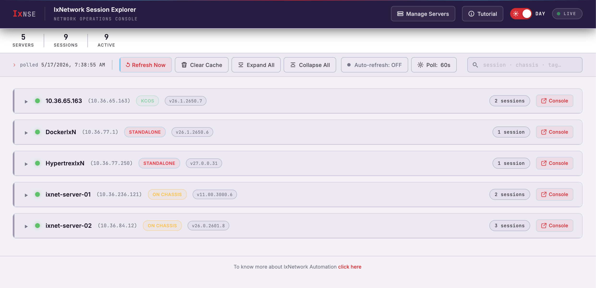
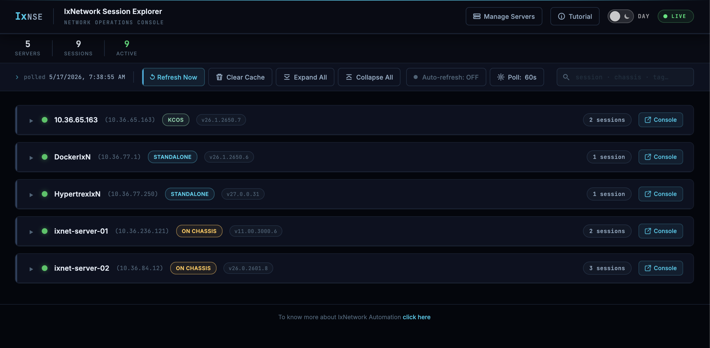
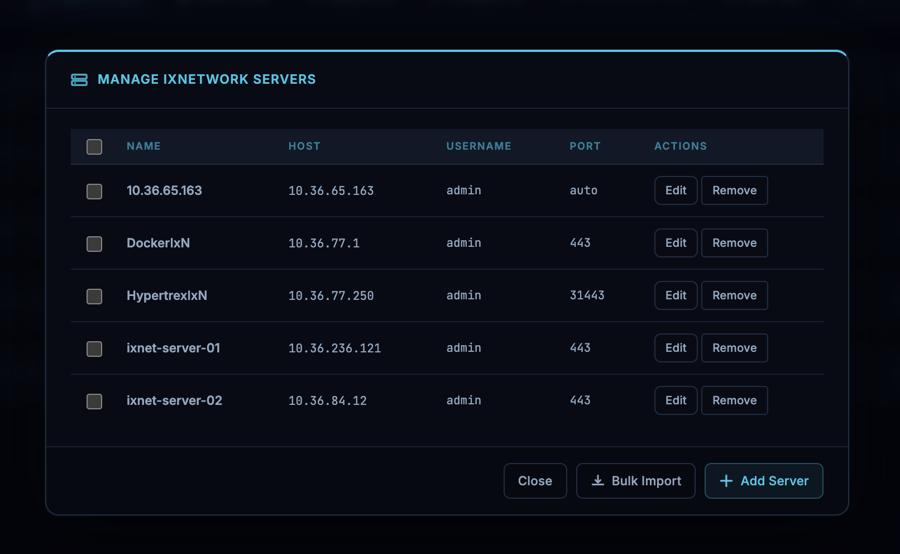

# IxNetwork Session Explorer (IxNSE)

## App Preview

**Day mode**


**Night mode**


**Manage Servers**


---

Dashboard for lab admins to track IxNetwork sessions across multiple chassis. Shows which sessions are actively using resources (control plane + data plane). No config file — servers managed via UI, persisted in SQLite.

---

## Quickstart

```bash
./start.sh --build   # first run — builds images
./start.sh           # subsequent starts
```

Starts three services: **backend API** (8080), **frontend UI** (3000), **MCP server** (8889).

> Ubuntu 20.04+: `start.sh` auto-installs Docker CE if missing. Other systems: install [Docker](https://docs.docker.com/engine/install/) first.

**After start:**
1. Open **http://localhost:3000**
2. UI → **Manage Servers** → **Add Server** — enter host/IP, credentials, port (default 443), click **Test Connection**, then **Save**
3. Connect Claude Code: `claude mcp add --transport http ixnse http://localhost:8889/mcp`

**Stop:**
```bash
docker compose down      # stop
docker compose down -v   # stop + delete database
```

---

## Services

| Service | URL |
|---------|-----|
| UI | http://localhost:3000 |
| API | http://localhost:8080 |
| API Docs | http://localhost:8080/docs |
| Health | http://localhost:8080/health/ |
| Metrics | http://localhost:8080/metrics |
| MCP Server | http://localhost:8889/mcp |

---

## Environment Variables

| Variable | Default | Description |
|----------|---------|-------------|
| `IXSE_DB` | `ixse.db` | SQLite database path |
| `IXSE_POLL_INTERVAL` | `60` | Poll interval in seconds (UI value takes precedence) |

---

## API

### Sessions

| Method | Path | Description |
|--------|------|-------------|
| `GET` | `/sessions` | All sessions across all servers |
| `GET` | `/sessions/{server}/{id}` | Single session detail |
| `PATCH` | `/sessions/{server}/{id}/tags` | Add / remove tags |
| `DELETE` | `/sessions/{server}/{id}?confirm=true` | Kill session |
| `POST` | `/sessions/{server}/{id}/collect-logs` | Download diagnostic logs |

### Servers

| Method | Path | Description |
|--------|------|-------------|
| `GET` | `/servers` | List servers (password masked) |
| `POST` | `/servers` | Add server |
| `PUT` | `/servers/{name}` | Update server |
| `DELETE` | `/servers/{name}` | Remove server |
| `POST` | `/servers/probe` | Test credentials without saving |
| `POST` | `/servers/{name}/test` | Test saved server connectivity |
| `PATCH` | `/servers/{name}/tags` | Add / remove server tags |
| `POST` | `/servers/bulk` | Upsert multiple servers |
| `DELETE` | `/servers/bulk` | Delete multiple servers |
| `PATCH` | `/servers/bulk/password` | Update password for multiple servers |

### Poller

| Method | Path | Description |
|--------|------|-------------|
| `POST` | `/poll/trigger` | Force immediate poll |
| `GET` | `/poll/status` | Last/next poll time, is_polling flag |
| `PATCH` | `/poll/config` | Update poll interval |

---

## MCP Server

MCP server (`mcp/`) exposes all IxNSE operations as tools for Claude Code, Claude Desktop, or any MCP-compatible client. Transport: **streamable HTTP**.

### Start

**Docker — via `./start.sh` (default):**
```bash
./start.sh           # MCP starts automatically
./start.sh --no-mcp  # skip MCP
```

**MCP only — backend running elsewhere:**
```bash
docker compose build mcp
IXNSE_API_URL=http://my-ixnse-host:8080 docker compose up -d mcp

# or raw docker
docker run --rm -p 8889:8889 \
  -e IXNSE_API_URL=http://my-ixnse-host:8080 \
  ixnetworksessionexplorer-mcp
```

**Manually (no Docker):**
```bash
cd mcp
uv venv && source .venv/bin/activate
uv pip install -e .
ixnse-mcp --api-url http://localhost:8080

# without installing
uv run ixnse-mcp --api-url http://localhost:8080
```

MCP endpoint: `http://localhost:8889/mcp` · Health: `http://localhost:8889/`

---

### Configure: Claude Code

```bash
# Per-workspace (default)
claude mcp add --transport http ixnse http://localhost:8889/mcp

# User-wide
claude mcp add --transport http --scope user ixnse http://localhost:8889/mcp

# Project-wide (committed as .mcp.json)
claude mcp add --transport http --scope project ixnse http://localhost:8889/mcp

# Remote backend override
claude mcp add --transport http ixnse "http://localhost:8889/mcp?backend=http://ixnse.lab.example.com:8080"

# Verify
claude mcp list
```

Manual (`~/.claude/settings.json` or `.claude/settings.json`):
```json
{
  "mcpServers": {
    "ixnse": {
      "type": "http",
      "url": "http://localhost:8889/mcp"
    }
  }
}
```

---

### Configure: Claude Desktop

| OS | Config file |
|----|-------------|
| macOS | `~/Library/Application Support/Claude/claude_desktop_config.json` |
| Windows | `%APPDATA%\Claude\claude_desktop_config.json` |
| Linux | `~/.config/Claude/claude_desktop_config.json` |

```json
{
  "mcpServers": {
    "ixnse": {
      "type": "http",
      "url": "http://localhost:8889/mcp"
    }
  }
}
```

Restart Claude Desktop after editing. Append `?backend=<url>` to target a remote IxNSE instance.

---

## Local Dev (no Docker)

**Terminal 1 — Backend:**
```bash
cd backend
uv venv && source .venv/bin/activate
uv pip install -e ".[dev]"
uvicorn ixse.api.main:app --host 0.0.0.0 --port 8080 --reload
```

**Terminal 2 — Frontend:**
```bash
cd frontend && python3 -m http.server 3000
```

**Terminal 3 — MCP:**
```bash
cd mcp
uv venv && source .venv/bin/activate
uv pip install -e .
ixnse-mcp --api-url http://localhost:8080
```
